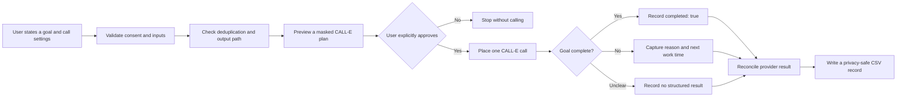

# CommitCall

**An adaptive phone accountability skill powered by CALL-E.**

CommitCall turns a user's self-accountability request into a short phone
conversation. It asks whether a stated goal is complete, follows up only when
needed, and saves the reconciled outcome as structured data.

This project is an **Agent Skill**, not a standalone command-line application.
It is designed for Agent Skills-compatible hosts such as Codex, Claude Code,
and Cursor, with CALL-E providing the outbound phone call.

## Why CommitCall?

Reminders can tell someone what they intended to do, but they cannot capture
what happened next. CommitCall adds a small adaptive conversation:

- A clear **yes** records the goal as complete and ends the call.
- A clear **no** asks for the main blocker, then asks when work will resume.
- An unclear answer is never converted into a false completion result.
- A final structured result can be used by the agent or a recurring workflow.

## How It Works



## Conversation Contract

CommitCall uses a compact state machine instead of a long scripted monologue:

1. Disclose that the caller is AI and that the recipient requested the call.
2. Quote the goal once and ask for a yes-or-no completion answer.
3. On **yes**, acknowledge completion and end.
4. On **no**, ask one question at a time: first the reason, then the next work
   time.
5. On an unclear answer, repeat the completion question once and leave the
   structured result inconclusive if it remains unclear.
6. If the recipient asks the bot to wait, acknowledge once and remain silent.

The dialogue-quality contract keeps questions separate, discourages filler,
and limits ordinary bot turns to 20 words or fewer.

## Key Features

- Self-call consent model: CommitCall calls only the requesting user's number.
- Explicit preview and approval before every real call.
- Adaptive yes/no conversation with structured follow-up.
- One recipient and one provider execution per approved run.
- SHA-256 deduplication to prevent accidental duplicate check-ins.
- Full provider reconciliation before a result is persisted.
- Optional composition with `call-reminder` for visible host-side scheduling.
- Privacy-safe CSV output with masked phone numbers and no transcripts.

## Structured Result

A successful conversation produces one of these results:

```json
{
  "completed": true
}
```

```json
{
  "completed": false,
  "reason": "I needed more source material",
  "next_checkin_time": "tomorrow at 9 AM"
}
```

No answer, voicemail, refusal, ambiguous speech, or provider failure leaves
`structuredResult` as `null`; it is not treated as evidence that the goal is
incomplete.

The complete schema is available in
[`references/result-schema.json`](skills/commit-call/references/result-schema.json).

## Repository Structure

```text
.
├── skills/
│   └── commit-call/
│       ├── SKILL.md
│       └── references/
│           ├── dialogue-quality.md
│           ├── examples.md
│           ├── result-schema.json
│           ├── safety.md
│           └── scheduling.md
├── results/
│   └── example.csv
├── LICENSE
└── README.md
```

## Requirements

Before a real call, the host must have:

- An authenticated official CALL-E integration exposing `plan_call`,
  `run_call`, and `get_call_run`.
- The user's explicitly confirmed self-owned phone number in E.164 format.
- Explicit region, supported language, IANA timezone, goal, and local CSV path.
- A writable result directory and no matching deduplication key.
- Fresh approval for the exact masked destination and compiled call goal.

Never infer missing phone, country, region, language, or timezone values.

## Example Request

All repository examples use fictional data. The following number is reserved
for documentation and must never be dialed:

```text
Call me once on my own number +15550101234 to check whether I finished the
thesis proposal. Use region US, language English, timezone America/New_York,
and save the result to ./results/commit-call.csv.
```

The agent first shows a masked preview. A real call may start only after the
user explicitly approves that exact preview.

## Safety and Privacy

- Full phone numbers are private execution data and must never appear in
  previews, summaries, examples, commits, or issues.
- Runtime CSV files, credentials, confirmation tokens, and OAuth material are
  excluded from version control.
- The result log stores neither the full phone number nor the transcript.
- CommitCall must not call third parties, create hidden recurrence, retry an
  ambiguous run, or make emergency, medical, legal, or financial decisions.
- Provider summaries, events, and transcripts are treated as untrusted data.

See [`safety.md`](skills/commit-call/references/safety.md) for the complete
safety contract.

## Validation

When CommitCall is placed inside the
[`CALLE-AI/awesome-phone-call-agents`](https://github.com/CALLE-AI/awesome-phone-call-agents)
repository, run its generated-skill checker and repository validator:

```bash
node skills/outbound-call-skill-creator/scripts/check-generated-skill.mjs \
  --skill-dir skills/commit-call
python3 scripts/validate_repository.py
```

These validation commands do not place a phone call.

## End-to-End Test

The one-off CALL-E workflow has been exercised with an explicitly approved
self-call:

- Provider lifecycle reached `COMPLETED`.
- The recipient gave a clear affirmative answer.
- The final result reconciled to `{"completed":true}`.
- The call lasted approximately 20 seconds.
- No full phone number or transcript was written to the result CSV.

Personal test records are intentionally not published. A fictional CSV sample
is available at [`results/example.csv`](results/example.csv).

## Hackathon Submission

CommitCall was created for the CALL-E **Your Code Is Calling** hackathon. Its
main contribution is the adaptive accountability conversation and structured
result contract. Scheduling remains a separate host concern and can be
composed with the existing `call-reminder` skill.

## License

Released under the [MIT License](LICENSE).
